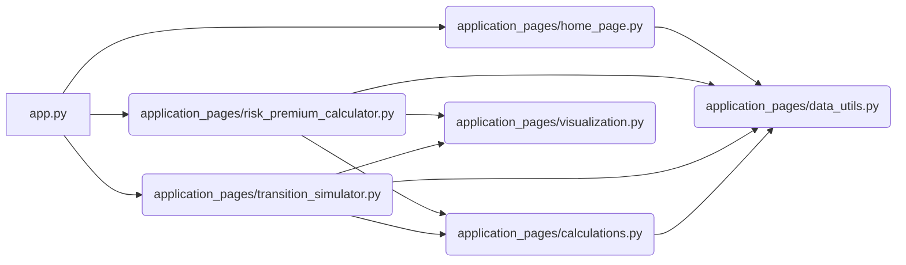

id: 685e9f966d454e734c158ea3_documentation
summary: AI Risk Score - V4-2 Documentation
feedback link: https://docs.google.com/forms/d/e/1FAIpQLSfWkOK-in_bMMoHSZfcIvAeO58PAH9wrDqcxnJABHaxiDqhSA/viewform?usp=sf_link
environments: Web
status: Published
# AI Risk Score Codelab: Understanding and Mitigating Career Risk in the Age of AI

This codelab provides a comprehensive guide to understanding and utilizing the "AI Risk Score" application. In an era defined by rapid technological advancements, particularly in Artificial Intelligence, it's crucial to assess and manage the risks associated with potential job displacement. This application is designed to help you evaluate your personal and professional exposure to these risks and explore strategies to enhance your career resilience.

## Introduction: Why is this Application Important?
Duration: 00:05

This application provides a unique way to quantify and visualize career risk in the age of AI. It goes beyond simple predictions and offers a framework for understanding the various factors that contribute to job security in a rapidly evolving landscape.

**Key Concepts Covered:**

*   **Idiosyncratic Risk:** Risk specific to an individual, based on skills, experience, and upskilling efforts.
*   **Systematic Risk:**  Broader, macro-level risk inherent to an occupation or industry due to automation.
*   **Career Path Diversification:** A strategy to mitigate systematic risk by transitioning to less vulnerable roles.
*   **"Education is Insurance":** The idea that continuous learning can protect against job displacement.

By working through this codelab, you'll gain a deep understanding of how the application calculates these risks and how you can use it to make informed decisions about your career.

## Setting up the Environment
Duration: 00:02

This application is built using Streamlit, a Python library for creating interactive web applications. To run this application, you'll need Python installed (version 3.7 or higher) along with the necessary libraries.

1.  **Install Streamlit:**
    ```console
    pip install streamlit
    pip install pandas
    pip install numpy
    pip install plotly
    ```

2.  **Download the Application Files:** Download all the python files (`app.py`, `application_pages/data_utils.py`, `application_pages/calculations.py`, `application_pages/visualization.py`, `application_pages/home_page.py`, `application_pages/risk_premium_calculator.py`, `application_pages/transition_simulator.py`)

3.  **Run the Application:** Open your terminal, navigate to the directory where you saved the files, and run the following command:
    ```console
    streamlit run app.py
    ```

This will launch the application in your web browser.

## Exploring the Home Page
Duration: 00:03

The home page (`application_pages/home_page.py`) provides an introduction to the AI Risk Score application and explains the key concepts behind it.

**Key elements of the home page:**

*   **Introduction to AI Risk Score:** Explains the purpose of the tool and its relevance in today's job market.
*   **Explanation of Idiosyncratic and Systematic Risk:** Defines these two types of risks and highlights the factors that influence them.
*   **The "Education is Insurance" Concept:**  Emphasizes the importance of continuous learning as a strategy for mitigating career risk.
*   **How it Works:** Provides a brief overview of the application's underlying models and calculations.
*   **Navigation Guide:**  Instructs users on how to navigate the application using the sidebar.

<aside class="positive">
The home page serves as an excellent starting point for understanding the overall goals and principles behind the AI Risk Score application. <b>Understanding these concepts is crucial before diving into the calculations and simulations.</b>
</aside>

## Diving into the Risk & Premium Calculator
Duration: 00:15

The Risk & Premium Calculator (`application_pages/risk_premium_calculator.py`) is the core of the application. It allows you to input your personal and professional details to calculate your Idiosyncratic Risk, Systematic Risk, and estimated Monthly Insurance Premium.

**Functionality Breakdown:**

1.  **Input Sections:** The calculator is divided into several input sections, allowing you to provide detailed information about your:
    *   **Current Profile:** Job Title, Years of Experience, Education Level, Education Field, Institution Tier, and Company Type.
    *   **Upskilling Efforts:** Percentage of general and firm-specific skill training completed.
    *   **Environmental Modifiers:** Economic Climate Modifier and AI Innovation Index.
    *   **Actuarial Parameters:** Annual Salary, Coverage Percentage, Coverage Duration, Loading Factor, and Minimum Monthly Premium.

2.  **Calculations:** Based on your inputs, the application performs a series of calculations to determine your:
    *   **Human Capital Factor (FHC):** Assesses your foundational resilience based on education, experience, and role.
    *   **Company Risk Factor (FCR):** Evaluates the stability and AI adoption of your current employer.
    *   **Upskilling Factor (FUS):** Quantifies the impact of your general and firm-specific training efforts.
    *   **Raw Idiosyncratic Risk (V_raw):** Combines FHC, FCR, and FUS to calculate a raw measure of individual risk.
    *   **Idiosyncratic Risk (V_i(t)):** A normalized measure of individual risk, capped between 5 and 100.
    *   **Systematic Risk (H_i):** Reflects the macro-level automation hazard for your occupation and industry.
    *   **Annual Claim Probability (P_claim):** The probability of job displacement based on systemic and individual factors.
    *   **Annual Expected Loss (E[Loss]):** The potential financial loss due to job displacement.
    *   **Monthly Insurance Premium (P_monthly):** The estimated cost of insuring against job displacement.

3.  **Results Display:** The calculator displays the calculated risk scores and premium in a clear and concise manner.

4.  **Intermediate Calculations & Explanations:** Expandable sections provide detailed explanations of each calculation, including the underlying formulas and the rationale behind them. This helps you understand how each input factor contributes to the final risk scores and premium.

5.  **Visualization:** Bar charts visualize the relative contributions of different factors to the Idiosyncratic and Systematic Risks.

**Code Snippets and Explanations:**

*   **`calculate_fhc(job_title, education_level, education_field, school_tier, years_experience)` (calculations.py):**
    ```python
    def calculate_fhc(job_title, education_level, education_field, school_tier, years_experience):
        """
        Calculates the Human Capital Factor (FHC).
        FHC = f_role * f_level * f_field * f_school * f_exp
        """
        f_role = JOB_DATA[JOB_DATA['Job Title'] == job_title]['f_role'].iloc[0] if job_title in JOB_DATA['Job Title'].values else 1.0
        f_level = EDUCATION_LEVEL_DATA.get(education_level, 1.0)
        f_field = EDUCATION_FIELD_DATA.get(education_field, 1.0)
        f_school = SCHOOL_TIER_DATA.get(school_tier, 1.0)
        f_exp = calculate_f_exp(years_experience)

        FHC = f_role * f_level * f_field * f_school * f_exp
        return FHC
    ```
    This function calculates the Human Capital Factor (FHC) by multiplying several sub-factors that represent various aspects of an individual's skills and experience.

*   **`calculate_systematic_risk(h_base_t, m_econ, iai)` (calculations.py):**
    ```python
    def calculate_systematic_risk(h_base_t, m_econ, iai):
        """
        Calculates the Systematic Risk (H_i).
        H_i = H_base(t) * (w_econ * M_econ + w_inno * IAI)
        """
        w_econ = DEFAULT_PARAMS['w_econ']
        w_inno = DEFAULT_PARAMS['w_inno']
        H_i = h_base_t * (w_econ * m_econ + w_inno * iai)
        return H_i
    ```
    This function calculates the Systematic Risk (H_i) based on the base occupational hazard, economic climate modifier, and AI innovation index.

<aside class="negative">
Note that the premium calculation is a *simplified* model for illustrative purposes. <b>Real-world insurance premiums are far more complex and take into account a wider range of factors.</b>
</aside>

## Simulating Career Transitions
Duration: 00:10

The Career Transition Simulator (`application_pages/transition_simulator.py`) allows you to model the impact of changing career paths on your Systematic Risk over time. This is particularly useful for understanding how diversifying your skills and moving into less vulnerable roles can mitigate your exposure to AI-driven job displacement.

**Key Features:**

1.  **Current & Target Career Paths:** Select your current and target job titles from a list of options. The application retrieves the corresponding base occupational hazard (H_base) for each role.

2.  **Transition Parameters:** Define the Time-to-Value (TTV) period, which represents the number of months required for the transition to be fully effective. You can also specify the number of months elapsed since the start of the transition.

3.  **Environmental Modifiers:** Adjust the Economic Climate Modifier and AI Innovation Index to see how these factors affect your Systematic Risk during the transition.

4.  **Simulation Results:** The simulator displays your projected Systematic Risk at the specified month and generates a line chart showing the evolution of your Systematic Risk over the entire TTV period.

**Code Snippets and Explanations:**

*   **`calculate_h_base_ttv(k, ttv, h_current, h_target)` (calculations.py):**
    ```python
    def calculate_h_base_ttv(k, ttv, h_current, h_target):
        """
        Calculates the Time-to-Value (TTV) Modified Base Occupational Hazard (H_base(k)).
        H_base(k) = (1 - k/TTV) * H_current + (k/TTV) * H_target
        """
        if ttv == 0: # Avoid division by zero if TTV is 0 (should not happen with default min_value=1)
            return h_target
        k = min(k, ttv) # Cap k at TTV to ensure smooth transition
        H_base_k = (1 - k / ttv) * h_current + (k / ttv) * h_target
        return H_base_k
    ```
    This function calculates the Time-to-Value (TTV) Modified Base Occupational Hazard (H_base(k)).

*   **`plot_systematic_risk_over_time(df_risk_over_time)` (visualization.py):**
    ```python
    def plot_systematic_risk_over_time(df_risk_over_time):
        """
        Generates a Plotly line chart showing the simulated Systematic Risk (H_i)
        value over the TTV period as k progresses.
        """
        fig = px.line(df_risk_over_time, x='Months Elapsed', y='Systematic Risk (H_i)',
                      title='Projected Systematic Risk Reduction During Career Transition',
                      labels={'Months Elapsed': 'Months Since Transition Started',
                              'Systematic Risk (H_i)': 'Systematic Risk Score (H_i)'},
                      markers=True)

        fig.update_layout(hovermode="x unified",
                          xaxis_title="Months Elapsed Since Transition Started (k)",
                          yaxis_title="Systematic Risk Score (H_i)",
                          template="plotly_white",
                          font=dict(size=12))
        fig.update_traces(hovertemplate='Months: %{x}<br>Systematic Risk: %{y:.2f}<extra></extra>')

        return fig
    ```
    This function generates a Plotly line chart showing the simulated Systematic Risk (H_i) value over the TTV period as k progresses.

**Understanding the Visualization:**

The line chart visualizes the gradual reduction in Systematic Risk as you progress through your career transition. The initial risk associated with your current occupation diminishes over time, eventually aligning with the lower risk profile of your target career. This demonstrates the power of career path diversification as a risk mitigation strategy.

## Data and Parameter Management (data\_utils.py)
Duration: 00:05

The `data_utils.py` script is responsible for loading and managing the static data and default parameters used throughout the application. This includes:

*   **Job Data:** A DataFrame containing job titles, f\_role multipliers, H\_base scores, and industry information.
*   **Education Data:** Lookup tables for education level and field factors.
*   **School Tier Data:** A lookup table for institution tier factors.
*   **Company Type Data:** A lookup table for company type to base FCR values.
*   **Default Parameters:**  A dictionary containing default actuarial and weighting parameters.

**Importance of Data Management:**

Proper data management is crucial for ensuring the accuracy and consistency of the application's calculations. By centralizing the data loading logic in `data_utils.py`, we can easily update the data without modifying the core calculation logic.

## Application Architecture
Duration: 00:05

Here's a high-level overview of the application's architecture:



**Explanation:**

*   `app.py`: The main entry point of the application. It handles navigation and loads the appropriate page based on user selection.
*   `application_pages/`: Contains the code for each individual page of the application (Home, Risk & Premium Calculator, Transition Simulator).
*   `application_pages/calculations.py`: Contains the functions for performing the core risk calculations.
*   `application_pages/data_utils.py`: Responsible for loading and managing the static data and default parameters.
*   `application_pages/visualization.py`: Contains functions for generating visualizations using Plotly.

## Conclusion
Duration: 00:02

By completing this codelab, you should now have a solid understanding of the AI Risk Score application, its underlying calculations, and how you can use it to assess and mitigate your career risk in the age of AI. Remember that this application is a simplified model and should not be used for making definitive financial decisions. However, it provides a valuable framework for thinking about career risk and the importance of continuous learning and strategic career planning.
